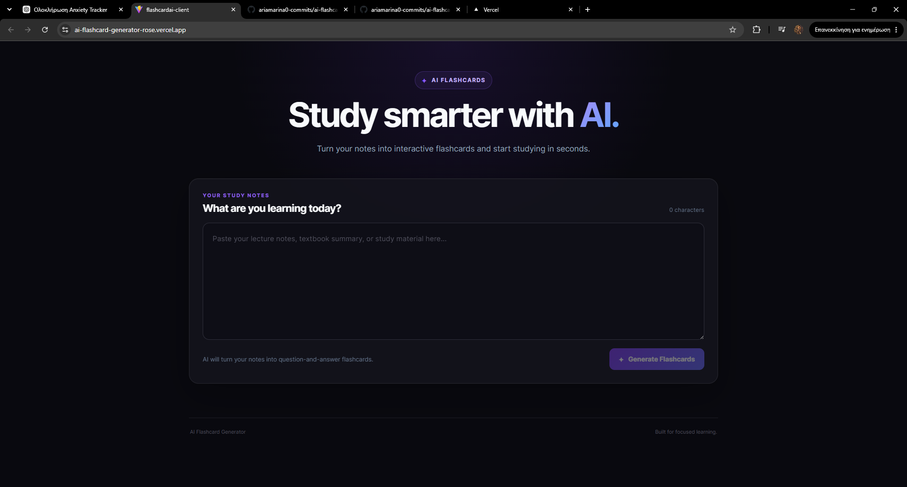
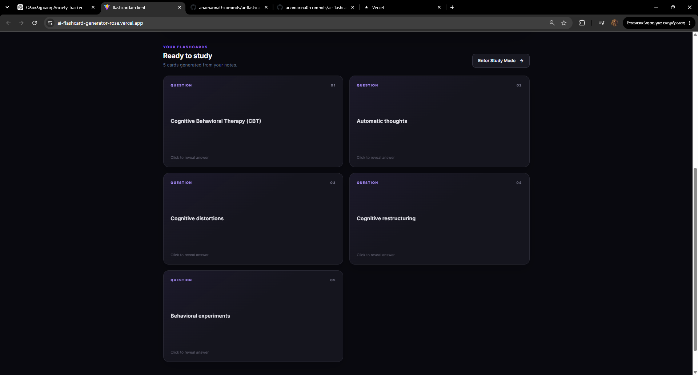
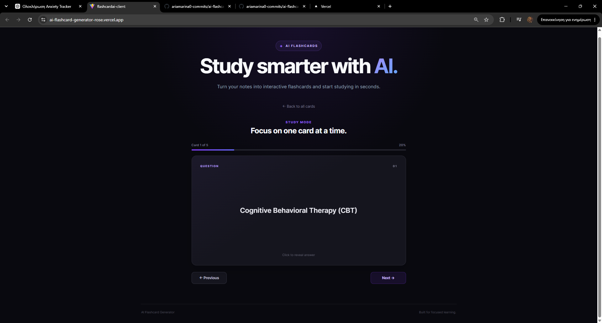

# AI Flashcard Generator

An AI-powered full-stack application that transforms study notes into interactive flashcards using Google Gemini.

Users can paste study material, generate concise question-and-answer flashcards with AI, flip through them interactively, and use a dedicated Study Mode for focused active recall.

🌐 **Live Application:**  
https://ai-flashcard-generator-rose.vercel.app/

## Features

- **AI-Powered Flashcard Generation**  
  Converts study notes into five concise question-and-answer flashcards using Google Gemini.

- **Interactive Flashcards**  
  Cards use 3D flip animations to reveal answers while keeping the study experience simple and focused.

- **Study Mode**  
  Provides a dedicated single-card study interface with Previous/Next navigation and progress tracking.

- **Responsive UI**  
  A custom React interface designed for desktop and mobile devices.

- **Full-Stack Architecture**  
  A React + TypeScript frontend communicates with an ASP.NET Core Web API responsible for AI generation.

- **Secure API Key Handling**  
  The Gemini API key is stored exclusively on the backend using .NET configuration and environment variables and is never exposed to the frontend.

## Tech Stack

### Frontend

- React
- TypeScript
- Vite
- Axios
- CSS

### Backend

- .NET 9
- ASP.NET Core Web API
- Google GenAI SDK
- Entity Framework Core
- SQLite scaffold for future persistence features

### Deployment

- **Frontend:** Vercel
- **Backend:** Render
- **Containerization:** Docker

## Architecture

```text
User
 │
 ▼
React + TypeScript
Vercel
 │
 │ HTTPS
 ▼
ASP.NET Core Web API
Render / Docker
 │
 │ Google GenAI SDK
 ▼
Google Gemini
 │
 ▼
Generated Flashcards
 │
 ▼
React UI
```

The frontend sends study material to the ASP.NET Core API.

The backend constructs the AI prompt and communicates with Google Gemini. Gemini returns structured flashcard data, which is deserialized by the API and returned to the React application for display.

Keeping Gemini communication on the backend prevents the API key from being exposed in the browser.

## Screenshots

### AI Flashcard Generator

Paste study notes and generate flashcards with AI.



### Generated Flashcards

Generated concepts are presented as interactive cards that can be flipped to reveal their answers.



### Study Mode

Study one card at a time with progress tracking and Previous/Next navigation.




## API

### Generate Flashcards

```http
POST /api/Flashcard/generate
```

Example request:

```json
{
  "text": "Study material goes here..."
}
```

The API generates five flashcards containing a question and answer derived from the submitted study material.

## Running Locally

### Prerequisites

You will need:

- .NET 9 SDK
- Node.js and npm
- A Google Gemini API key

### 1. Clone the repository

```bash
git clone https://github.com/ariamarina0-commits/ai-flashcard-generator.git
cd ai-flashcard-generator
```

### 2. Configure the backend

Navigate to the backend project:

```bash
cd FlashcardAI.server
```

Store the Gemini API key using .NET User Secrets:

```bash
dotnet user-secrets set "Gemini:ApiKey" "YOUR_API_KEY"
```

Run the API:

```bash
dotnet run
```

By default, the local frontend expects the API at:

```text
http://localhost:5265
```

### 3. Run the frontend

Open another terminal and navigate to:

```bash
cd FlashcardAI.Client
```

Install dependencies:

```bash
npm install
```

Start the Vite development server:

```bash
npm run dev
```

The application will then be available through the local Vite development URL.

## Configuration

The frontend reads the backend URL from:

```text
VITE_API_BASE_URL
```

If the variable is not provided, development falls back to:

```text
http://localhost:5265
```

Production backend configuration includes:

```text
Gemini__ApiKey
AllowedOrigins__0
```

CORS is restricted to configured frontend origins rather than allowing arbitrary origins.

## Deployment

The application is deployed as two independent services.

The React frontend is built with Vite and deployed to **Vercel**.

The ASP.NET Core API is containerized with **Docker** and deployed to **Render**, where it communicates securely with Google Gemini.

```text
Vercel
   ↓
Render
   ↓
Google Gemini
```

## Future Development

The current version focuses on the core AI flashcard-generation and study experience.

Potential future development includes:

- User authentication
- Persistent flashcard storage
- Saved study decks
- Deck organization and management
- Study history and progress tracking
- Expanded study and review tools

The project already contains an Entity Framework Core / SQLite foundation that can support future persistence and user-related functionality.

## Author

**Marina**

Software Engineering graduate currently studying Psychology, Psychotherapy and Counselling.

GitHub:  
https://github.com/ariamarina0-commits